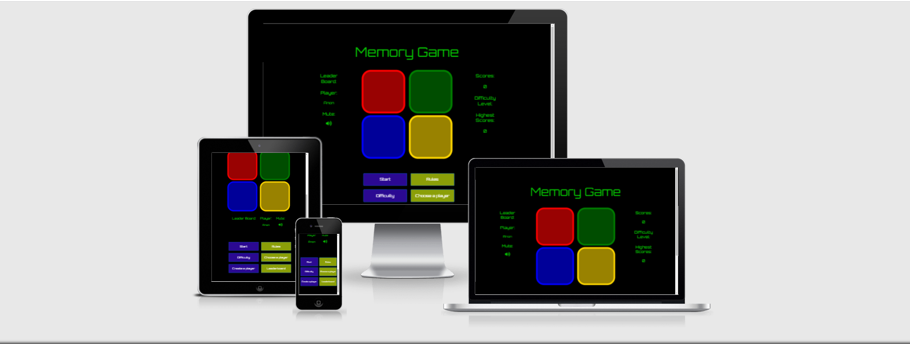
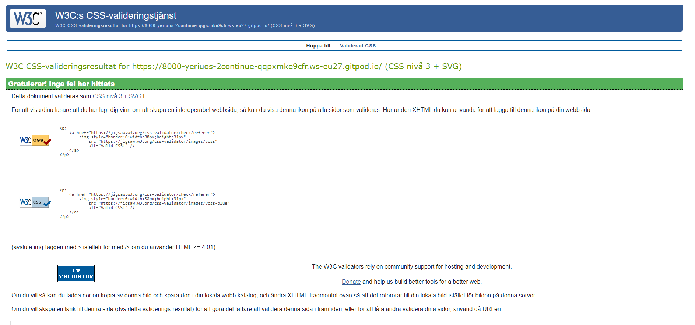
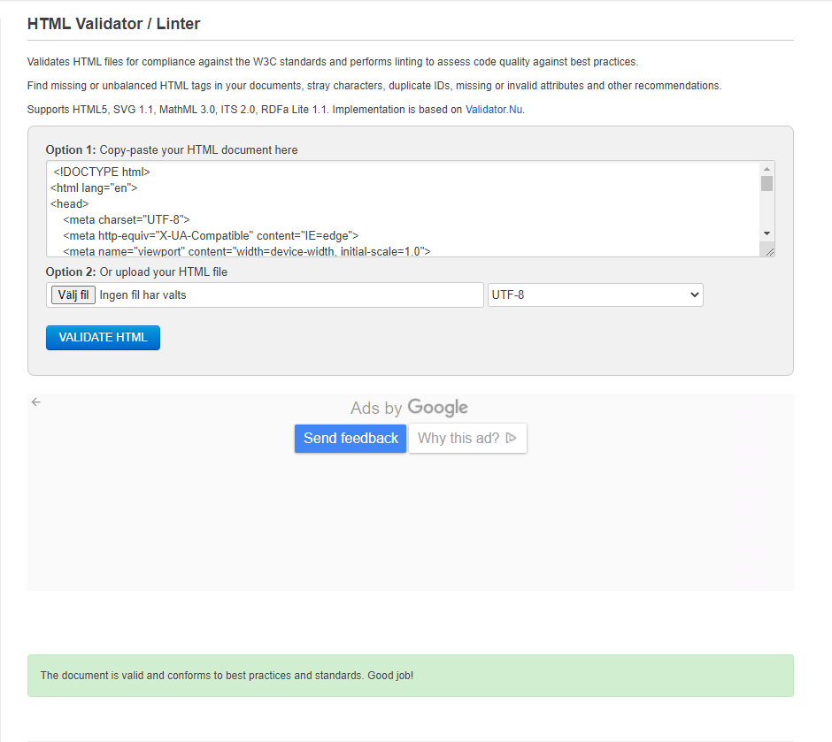

# Memory Game

[View the live project here](https://github.com/LySeriuos/MS2-continue)

## Table of contents
1. [`Introduction`](#introduction)
2. [`UX`](#ux)    
    1. [`Design`](#design)
3. [`Features`](#features)
4. [`Issues and Bugs`](#issues-and-bugs)
5. [`Technologies Used`](#technologies-Used)
     1. [`Main Languages Used`](#main-languages-used)    
     2. [`Frameworks, Libraries & Programs Used`](#frameworks,-libraries-&-programs-Used)
6. [`Testing`](#automated-testing)
7. [`Further testing`](#further-testing)    
8. [`Deployment`](#deployment)    
9. [`Credits`](#credits)
     1. [`Audio`](#audio)
10. [`Acknowledgements`](#acknowledgements)
[`Back to top ⇧`](#memory-game)

***
## Introduction
---
* **Memory Game** is online game based on popular table game named **Simon**. Target is to check how good yor memory is! The Memory Game fits all ages from arround 2 years old to let's say 99! The main goal is to repeat given sequneces and  get better result than last time also beat on scores your friends. 

* Memory Game is my second Milestone project and this is 2nd of 4 projects during the Software Developer Program at The Code institute.

[`Back to top ⇧`](#memory-game)

### Requirements
---
1. HTML, CSS, JavaScript.
2. Users are able to interact with the site in their particular way, to achieve their
personal goals and derive answers to their specific questions.
The site owner advances their own goals by providing this functionality, potentially
by being a regular user themselves.
3. Documentation: Write a README.md file for your project that explains what the project does and the value that it provides to its users.
4. Version Control: Use Git & GitHub for version control.
5. Attribution: Maintain clear separation between code written by you and code from external sources (e.g. libraries or tutorials). Attribute any code from external sources to its source via comments above the code and (for larger dependencies) in the README.
6. Deployment: Deploy the final version of your code to a hosting platform such as GitHub Pages.

[`Back to top ⇧`](#memory-game)

### UX
---

The potential user of this Memory Game:
* All ages from 2 years old.

What players are willing to find:

* Fun game, easy to understandt.
* To Load and Play.
* To be able to save scores.
* To compete with friends.
* To change difficulty levels.

[`Back to top ⇧`](#memory-game)

## Skeleton 
---
Wireframe mockups were created in a [Figma Workspace](https://www.figma.com/file/kjBYFWsBWVAjqQOGtqMmTf/Memory-game-MS2?node-id=0%3A1) for the positive expierence:

Index Page:

### Design
---
* The main idea was to create a stylish one page game with simple design to be easy understanble. The main font is ["Orbitron"](https://fonts.google.com/specimen/Orbitron). As a back up font going to be "Sans Serif". 
* The heart of the game is four quadrants in red, blue, green and yellow. This recreates "Simone" game colours. 
* Buttons has slightly different colourss: purple and light green. 
* The main colours are black and green. Black is background colour and green is for the game status and information. It is eye catching combo and it look like it is from space :) All colours together gives lively and playful feeling to player.
* Midle of the page was given to the heart of the game. These quadrants takes most space as it is the most important part. Around it is game stats and player information. This information is visible in all screen sizes and is easy to read and understand. at the bottom we can find all the menu buttons. These stays at the bottom at all screen sizes because user is not going to use them often.

[`Back to top ⇧`](#memory-game)

### Features
---
* The Memory Game developed as responsive. It can be played on mobile phones, tablet computers and on big screens.
* The Memory Game builded as a simple single-player pattern-matching memory game.
* Player can play as Anonym player or he/she can create own player and compete to other players.
* Three game speeds to choose. Easy, Medium or Hard.
* Game sounds for all game actions. Winning and loosing sound instead of "alarm messages".
* Mute/Unmute button for the game sounds.
* Memory game page layout shows:
  * Leader Board of best three players.
  * Current player name.
  * Buttons for game menu.
  * Current scores.
  * Chosen difficulty level.
  * Current player highest scores off all time.

  [`Back to top ⇧`](#memory-game)  

## Further Testing 
## Code

* The Memory Game was tested on Google Chrome, Opera, Mozilla Firefox, Microsoft Edge and Safari, mobile Safari, mobile Chrome browsers.
* The Memory Game was viewed on a variety of devices such as Desktop, Laptop, Android phones, iPhone7, iPhone 8 & iPhone13.
* Friends and family members were asked to review the game and documentation to point out any bugs and/or user experience issues.
* All known bugs are fixed.

[`Back to top ⇧`](#memory-game)

### Issues-and-Bugs
---
1. Issue with the game sounds. 
During test on iphone 13 **Safari** Mobile noticed that sound is very delayed while all other browsers had no issues.   
I found a solution to put all game sounds to buffert after page loads. It had fixed the issue with the **Safari**.
2. Issue with the **mute/unmute** button. After I fixed issue with mobile Safari it gave me another issue that my mute/unmute button doesn't worked because I used buffert. All sounds was taken from there and not played directly from the page.   
Issue was fixed by rewriting buffer source to empty for **mute** and for **unmute** it was rewrited again as normal, with the sounds.
3. Issue with **:active** while touching/clicking color squares in the game.  
During test on mobile **Safari** ( All other browser had no issue) there was no visual effect while touching/clicking game squares. I had to lower transparency to 0,9 in my RGBA for **:Active** to fix this issue. 
4. Issue with delaying touch reaction on mobile **Safari**. During test on Iphone 13 the game couldn't take all touches if it was touched/clicked fast.
The issue was solved by adding eventListener **'touchStart'**. All other tested browsers doesn't had this issue. 
5. Issue with **:Hover** on touch devices. This issue was on all mobile devices. After the button was touched the **:Hover** effect wasn't disapearing untill it was touched on other place or other button. The issue was fixed by chinging **:Hover** to **:Active** effect. Color change only while touching to inform player that it was touched.
6. Underline hover had the line on all the buttons. Removed by **"text-decoration: none;"**
7. I had an issue with scores. After changing player and if this player were already created and saved in array, JS took old scores and I couldn't made it to start from zero when playing from begining. I had to **reload page** **(window.location.reload())** to get starting scores at 0. That causes new issue:
8. After page reload I couldn't display correct players name in the HTML. It was always showing default name "Anon" or the last name in the array. It depend on which **if statement** I was using. To be able to use chose name from drop down names list I created new key in the local Storage to save user's selection. After that I could get selected name from **dropdown list** or new created name by changing manually if statement but never by JS. To fix this issue I had to put if statement in the **onload function ($(document).ready(function())** and if it was created new name, delete slected name key in local storage.

[`Back to top ⇧`](#memory-game)

## Automated Testing

### Code Validation
The [FreeFormatter Validator](https://www.freeformatter.com/html-validator.html) service was used to validate the `HTML` code used.
The [W3C CSS Validator](https://jigsaw.w3.org/css-validator/) service was used to validate the `CSS` coded used.

**Results:**

- Index Page

     
     

[`Back to top ⇧`](#memory-game)

## Deployment

* GitHub Pages
The project was deployed to GitHub Pages using the following steps...

* Log in to GitHub and locate the GitHub Repository
* At the top of the Repository (not top of page), locate the "Settings" Button on the menu.
* Alternatively Click Here for a GIF demonstrating the process starting from Step 2.
* Scroll down the Settings page until you locate the "GitHub Pages" Section.
* Under "Source", click the dropdown called "None" and select "Master Branch".
* The page will automatically refresh.
* Scroll back down through the page to locate the now published site link in the "GitHub Pages" section.
* Forking the GitHub Repository
* By forking the GitHub Repository we make a copy of the original repository on our GitHub account to view and/or make changes without affecting the original repository by using * the following steps...

Log in to GitHub and locate the GitHub Repository
At the top of the Repository (not top of page) just above the "Settings" Button on the menu, locate the "Fork" Button.
You should now have a copy of the original repository in your GitHub account.
Making a Local Clone
Log in to GitHub and locate the GitHub Repository
Under the repository name, click "Clone or download".
To clone the repository using HTTPS, under "Clone with HTTPS", copy the link.
Open Git Bash
Change the current working directory to the location where you want the cloned directory to be made.
Type git clone, and then paste the URL you copied in Step 3.
$ git clone https://github.com/YOUR-USERNAME/YOUR-REPOSITORY
Press Enter. Your local clone will be created.
$ git clone https://github.com/YOUR-USERNAME/YOUR-REPOSITORY
> Cloning into `CI-Clone`...
> remote: Counting objects: 10, done.
> remote: Compressing objects: 100% (8/8), done.
> remove: Total 10 (delta 1), reused 10 (delta 1)
> Unpacking objects: 100% (10/10), done.
Click Here to retrieve pictures for some of the buttons and more detailed explanations of the above process.

[`Back to top ⇧`](#memory-game)

## Credits 

### Audio & Media
- All sounds were sourced from the [SoundsCrate](https://soundscrate.com/ "Link to SoundsCrate")
- All Images were sourced from the artist Romson Preechawit in [Unsplash](https://unsplash.com/ "Link to Unsplash") 
- The text used in the 404 error page was sourced from [CopyAndPasteFonts](https://www.copyandpastefont.com/ "Link to Font editor") and edited by the developer.

# Technologies Used
### Main Languages Used
- [HTML5](https://en.wikipedia.org/wiki/HTML5 "Link to HTML Wiki")
- [CSS3](https://en.wikipedia.org/wiki/Cascading_Style_Sheets "Link to CSS Wiki")
- [Java Script](https://en.wikipedia.org/wiki/JavaScript "Link to JS Wiki")

[`Back to top ⇧`](#memory-game)

### Frameworks, Libraries & Programs Used
- [Bootstrap](https://getbootstrap.com/docs/4.4/getting-started/introduction/ "Link to Bootstrap page")
     - Bootstrap was used to implement the responsiveness of the site, using bootstrap classes.
- [Google Fonts](https://fonts.google.com/ "Link to Google Fonts")
    - Google fonts was used to import the fonts "Roboto", "Lato" and "Montserrat" into the style.css file. These fonts were used throughout the project.
- [JQuery](https://jquery.com/ "Link to Jquery")
    - JQuery was used to simplify Java Script code.
- [Font Awesome](https://fontawesome.com/ "Link to FontAwesome")
     - Font Awesome was used to import icons mute/unmute.
- [Git](https://git-scm.com/ "Link to Git homepage")
     - Git was used for version control by utilizing the GitPod terminal to commit to Git and push to GitHub.
- [GitHub](https://github.com/ "Link to GitHub")
     - GitHub was used to store the project after pushing
- [Figma](https://www.figma.com/ "Link to Figma homepage")
     - Figma was used to create the wireframes during the design phase of the project.
- [Am I Responsive?](http://ami.responsivedesign.is/# "Link to Am I Responsive Homepage")
     - Am I Responsive was used in order to see responsive design throughout the process and to generate mockup imagery to be used.

[`Back to top ⇧`](#memory-game)

## Acknowledgements

- I would like to thank my friends and family for their valued opinions and critic during the process of design and development.
- I would like to thank my mentor, Seun, for her invaluable help and guidance throughout the process.
- I would like to thank tutor support for showing me the way with my issues.

[`Back to top ⇧`](#memory-game)

***